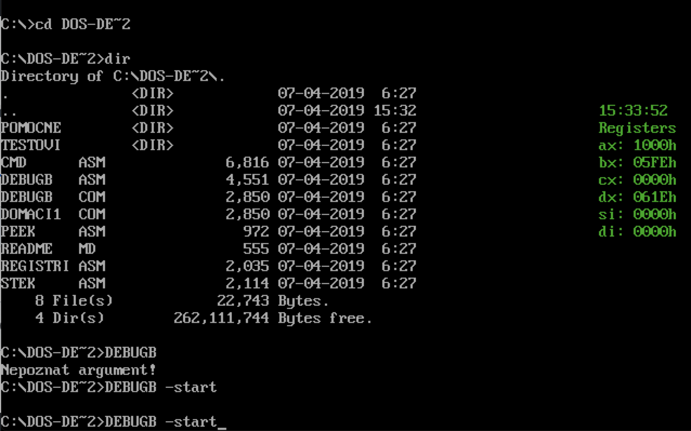

# DOS-debugbar

DOS-debugbar is an application written in assembler which helps programmers to know details about registers and stack in the moment of their application is running.

DOS-debugbar runs in the background (TSR mode).

To refresh your registers and stack status press F5
For moving debugbar across the console, use F1, F2, F3 and F4

Commands:

To run the programm:
```sh
$  debugb -start
```

To close the program:
```sh
$  debugb -stop
```

To read a byte from the memory:
```sh
$  debugb -peek {segment} {offset}
```

To write a byte in the memory:
```sh
$  debugb -poke {segment} {offset} {value}
```

